# VOLTRA

---

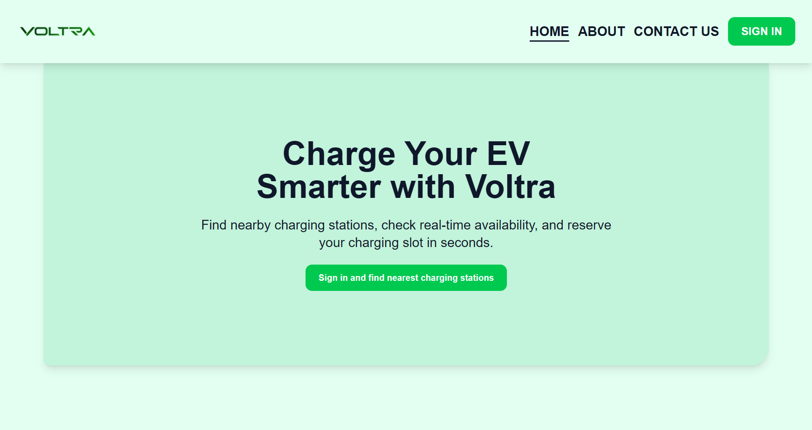
🔗 [View Live VOLTRA PLATFORM](https://voltra-app-xi.vercel.app)

---

## OVERVIEW

**VOLTRA** is a web-based electric vehicle charging platform designed to simplify the process of finding charging stations, reserving charging slots, managing bookings, and completing payments. The frontend provides an interactive interface where users can browse EV charging stations, view available charging slots, create and manage bookings, complete payments, and review their transaction history. The application also includes an administrative dashboard for managing charging stations, charging slots, and bookings.

The project demonstrates:

- Frontend development using Next.js and React
- Type-safe development using TypeScript
- Responsive UI development with Tailwind CSS
- REST API integration
- JWT-based authentication
- Role-based frontend route protection
- Booking and payment workflows
- Dynamic routing using the Next.js App Router
- Reusable React components
- Form validation and user feedback
- Integration with the VOLTRA NestJS backend
- Production deployment

---

## FRONTEND AND BACKEND DEPLOYMENTS

VOLTRA consists of a Next.js frontend application and a separate NestJS REST API backend. Both applications are deployed independently and connected through the configured backend API URL.

### Frontend Deployment

The VOLTRA frontend provides the main user interface for accessing charging stations, creating bookings, completing payments, managing reservations, and accessing administrative features.

```bash
https://voltra-app-xi.vercel.app
```

### Backend Deployment

The VOLTRA backend provides the REST API responsible for authentication, users, charging stations, charging slots, bookings, payments, and booking adjustments.

```bash
https://voltra-backend.vercel.app/api
```

---

## KEY FEATURES

Built using modern web technologies, **VOLTRA focuses on EV charging station discovery, charging slot booking, payment management, and secure role-based navigation to provide a simple and convenient EV charging experience**. This project represents a practical implementation of a full-stack EV charging reservation platform and demonstrates modern frontend web development using Next.js, Tailwind CSS, and TypeScript.

There are several types of features implemented in this platform, such as:

1. **Charging Station Discovery**. Displays available EV charging stations and their information, allowing users to browse charging locations and view the charging slots provided by each station.
2. **Charging Slot Booking System**. Allows users to select an available charging slot based on charger type, charging power, price, date, start time, and duration. The platform automatically displays the estimated energy usage and charging cost before the booking is completed.
3. **Booking Management System**. Users can view and manage their existing charging reservations through a dedicated booking page. Eligible bookings can be rescheduled or cancelled according to their current booking status.
4. **Payment and Booking Adjustment System**. Provides Card and E-Wallet payment options for charging reservations. When a paid booking is rescheduled, the platform handles additional payments when the new booking costs more and refunds when the new booking costs less.
5. **Transaction History**. Allows users to review their payment activity, including original booking payments, additional payments, and refunds, with a dedicated transaction detail page for individual transactions.
6. **Authentication and Protected Routes**. Implements user registration, login, JWT-based authentication, and protected application routes. Unauthenticated users are prevented from directly accessing booking, payment, profile, and other protected pages.
7. **User and Admin Role Management**. Provides separate navigation and functionality for `USER` and `ADMIN` roles. Regular users can manage their own charging activities, while administrators have access to an administrative dashboard for managing stations, charging slots, and bookings.
8. **Responsive and Reusable User Interface**. Uses reusable React components, responsive layouts, custom confirmation modals, and Next.js client-side navigation to provide a consistent and interactive experience across the VOLTRA platform.

---

## TECH STACK

VOLTRA is built using modern frontend technologies to provide a responsive, interactive, and maintainable EV charging reservation platform.

| Technology | Purpose |
| --- | --- |
| **Next.js 14** | Main React framework used to build the frontend application with the App Router and dynamic routing. |
| **React** | Used to build reusable and interactive user interface components. |
| **TypeScript** | Provides static typing for safer and more maintainable frontend development. |
| **Tailwind CSS** | Used for responsive layouts, styling, and the overall VOLTRA green-themed user interface. |
| **Lucide React** | Provides icons used throughout the application interface. |
| **Heroicons** | Provides additional UI icons for components and navigation elements. |
| **Fetch API** | Handles communication between the VOLTRA frontend and the backend REST API. |
| **JWT Authentication** | Used for authenticated API requests and protected user sessions. |
| **Next.js Middleware** | Provides frontend route protection for authenticated and role-based pages. |
| **Vercel** | Used to deploy and host the VOLTRA frontend application. |

---

## INSTALLATION AND USAGE INSTRUCTIONS

The VOLTRA frontend can be installed and run locally for development and testing. Before running the application, make sure **Node.js** and **npm** are installed on your computer and that the VOLTRA backend API is available either locally or through its deployed URL.

The frontend communicates with the VOLTRA backend through a REST API, so the backend API URL must be configured correctly before using features such as authentication, charging station discovery, booking management, payments, and transaction history.

### Prerequisites

Before installing the project, make sure the following requirements are available:

- Node.js
- npm
- Git
- VOLTRA Backend API
- Modern web browser such as Google Chrome, Microsoft Edge, or Mozilla Firefox

---

### 1. Clone the Repository

Clone the VOLTRA frontend repository from GitHub to your local computer:

```bash
git clone <YOUR-FRONTEND-REPOSITORY-URL>
```

This command creates a local copy of the VOLTRA frontend source code.

---

### 2. Navigate to the Project Directory

After cloning the repository, navigate into the VOLTRA frontend project directory:

```bash
cd <YOUR-PROJECT-FOLDER>
```

Make sure the terminal is running inside the project directory before installing the required dependencies.

---

### 3. Install Project Dependencies

Install all dependencies required by the VOLTRA frontend:

```bash
npm install
```

This command installs the packages defined in `package.json`, including the dependencies required by Next.js, React, TypeScript, Tailwind CSS, and other libraries used throughout the application.

---

### 4. Configure Environment Variables

Create a `.env.local` file in the root directory of the frontend project.

For local development, add the following environment variable:

```env
NEXT_PUBLIC_API_URL=http://localhost:3001/api
```

`NEXT_PUBLIC_API_URL` defines the base URL used by the VOLTRA frontend when sending requests to the backend REST API.

When both the frontend and backend are running locally, the frontend runs on:

```text
http://localhost:3000
```

while the VOLTRA backend API runs on:

```text
http://localhost:3001/api
```

For production deployment, replace the local backend URL with the deployed VOLTRA backend API URL.

---

### 5. Start the Development Server

Run the following command to start the Next.js development server:

```bash
npm run dev
```

After the development server starts successfully, the application can be accessed at:

```text
http://localhost:3000
```

Open this address in a web browser to access the VOLTRA landing page.

---

## APPLICATION USAGE

VOLTRA provides different functionality depending on whether the visitor is unauthenticated, authenticated as a regular user, or authenticated as an administrator.

The general user flow is:

```text
Landing Page
     ↓
Register / Login
     ↓
Charging Stations
     ↓
Select Charging Station
     ↓
Select Charging Slot
     ↓
Create Booking
     ↓
Complete Payment
     ↓
Manage Booking
     ↓
View Transaction History
```

### 1. Access the Landing Page

When users first open VOLTRA, they are presented with the public landing page.

The landing page introduces the VOLTRA EV charging platform and provides navigation to the authentication page. Visitors can access the landing page without creating an account or logging in.

---

### 2. Register or Login

Users must authenticate before accessing protected VOLTRA features.

New users can create an account through the registration form, while existing users can sign in using their registered email address and password.

After successful authentication, the frontend stores the authentication information required to communicate with protected backend API endpoints.

Regular users are directed to the charging station interface, while users with administrative privileges can access the administrative dashboard.

---

### 3. Browse Charging Stations

After authentication, users can browse the available EV charging stations provided by VOLTRA.

Each charging station contains information about its location and available charging slots. Users can select a station to inspect the charging options provided at that location.

Charging slot information includes details such as:

- Charger type
- Charging power
- Charging price
- Slot availability

This allows users to choose a charging option according to their EV charging requirements.

---

### 4. Create a Charging Booking

After selecting a charging station and charging slot, users can create a charging reservation.

Users select the required booking information, including:

- Charging slot
- Booking date
- Start time
- Charging duration

Based on the selected charging slot and duration, VOLTRA calculates the estimated charging energy and estimated booking cost before the booking proceeds to payment.

---

### 5. Complete the Booking Payment

After creating a booking, users can review the booking and payment information before completing the transaction.

VOLTRA provides payment interfaces for:

- Card
- E-Wallet

For card payments, users can enter their card and billing information through the payment form.

After a successful payment, the payment information is associated with the corresponding charging booking and the user can continue managing the reservation through the booking interface.

---

### 6. Manage Existing Bookings

Authenticated users can access their personal booking list to view and manage their charging reservations.

Each booking provides information such as the selected charging station, charging slot, booking schedule, estimated charging usage, estimated cost, payment information, and booking status.

Eligible bookings can also be rescheduled or cancelled through the booking management interface.

---

### 7. Reschedule a Paid Booking

VOLTRA supports price adjustments when an already-paid booking is rescheduled.

When the charging slot, schedule, or duration is changed, the application recalculates the estimated booking cost and compares it with the amount that has already been paid.

If the new booking has the same cost, the booking can be updated without another payment.

If the new booking costs more than the amount already paid, VOLTRA creates an **additional payment** for the price difference.

If the new booking costs less than the amount already paid, VOLTRA records a **refund** for the difference.

The adjustment flow can be summarized as:

```text
Updated Booking Cost
        ↓
Compare With Net Amount Paid
        ↓
 ┌────────────┬──────────────┬─────────────┐
 │ Same Price │ Higher Price │ Lower Price │
 │     ↓      │      ↓       │      ↓      │
 │   Update   │  Additional  │   Refund    │
 │  Booking   │   Payment    │             │
 └────────────┴──────────────┴─────────────┘
```

This allows VOLTRA to preserve the original payment transaction while maintaining a history of later payment adjustments.

---

### 8. View Payment and Transaction History

Users can access their profile to review their payment activity.

The transaction history can contain:

- Original booking payments
- Additional booking payments
- Refund transactions

Users can also open individual transaction details to review information associated with a specific payment or booking adjustment.

---

### 9. Access the User Profile

The profile page provides authenticated users with access to their account information and payment history.

From this section, users can review their VOLTRA account information and inspect transactions associated with their charging activities.

---

### 10. Admin Dashboard

VOLTRA also provides a dedicated administrative interface for users with the `ADMIN` role.

Administrators can access management functionality for platform resources such as:

- Charging stations
- Charging slots
- Bookings

The admin interface is separated from the regular user flow through role-based navigation and route protection.

Regular users attempting to directly access the administrative route are redirected away from the admin dashboard.

---

## ROUTE ACCESS

VOLTRA separates public, authenticated, and administrative pages.

Public pages such as the landing page and authentication page can be accessed without logging in.

Application pages related to charging stations, bookings, payments, transactions, and user profiles are protected and require authentication.

Examples of protected routes include:

```text
/stationPage
/bookingPage
/bookingsPage/*
/payment/*
/profilePage
```

Administrative routes are restricted to authenticated users with the `ADMIN` role:

```text
/admin/*
```

If an unauthenticated visitor attempts to directly access a protected route, the frontend redirects the visitor to the authentication page.

Frontend route protection improves the application's navigation and user experience, while authentication and authorization for protected API operations are enforced by the VOLTRA backend.

---

## LIVE APPLICATION

The deployed VOLTRA frontend can be accessed through the following link:

🔗 [View Live VOLTRA EV CHARGING PLATFORM](https://voltra-app-xi.vercel.app)

The production application communicates with the deployed VOLTRA backend API through the configured `NEXT_PUBLIC_API_URL` environment variable.

---

## PLATFORM'S SCREENSHOT
### LandingPage

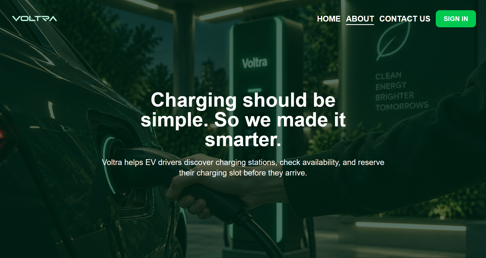
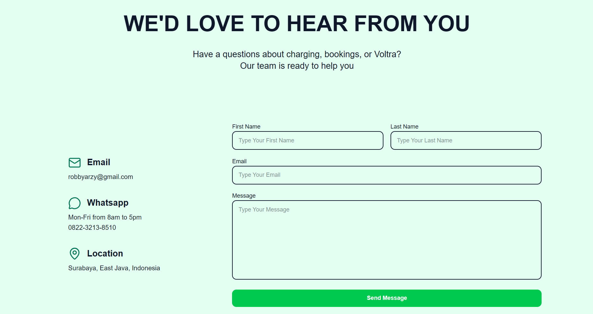

### AuthPage
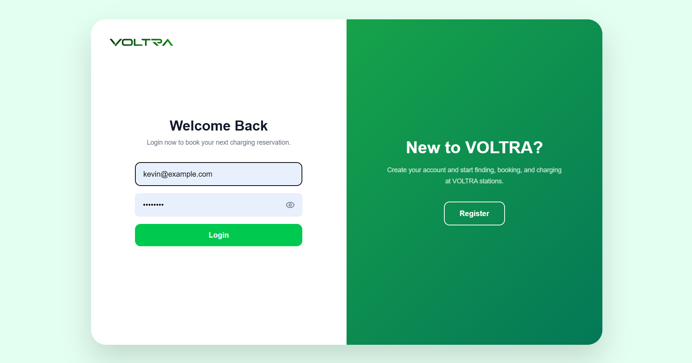
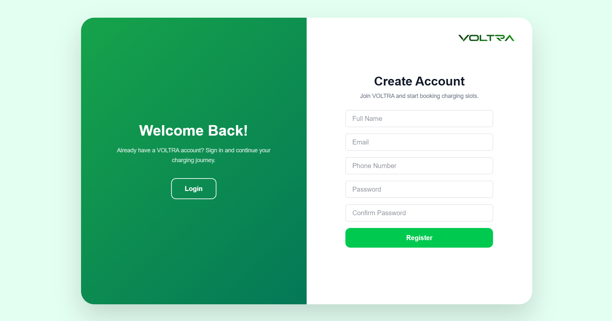

### StationPage
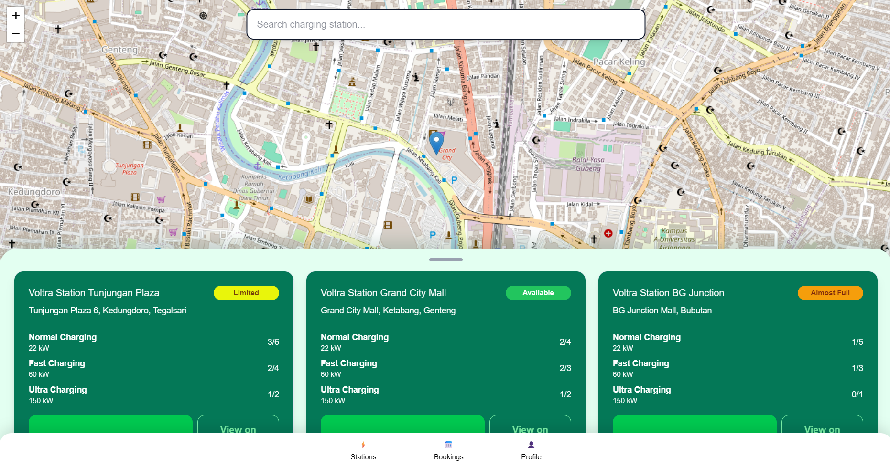
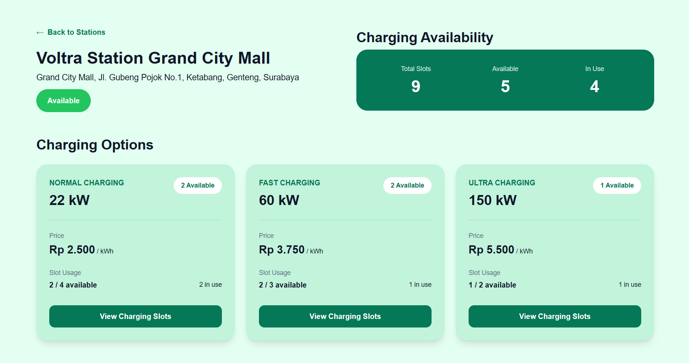
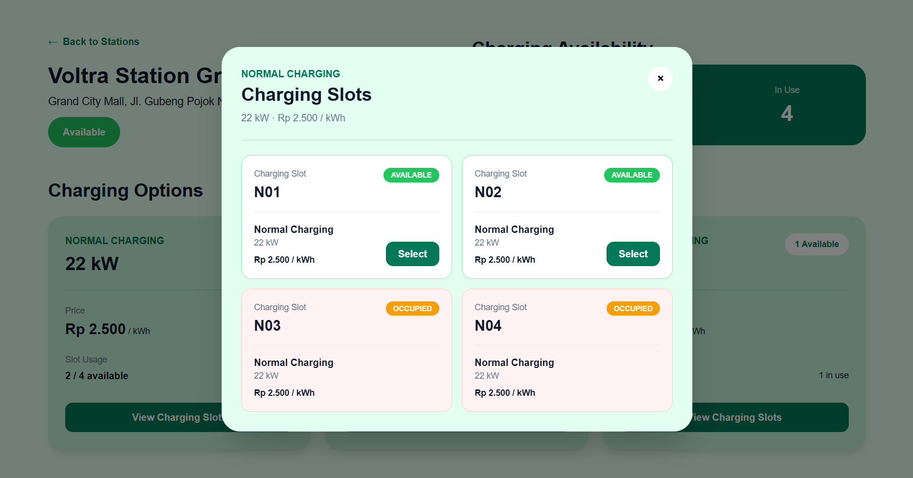

### PaymentPage
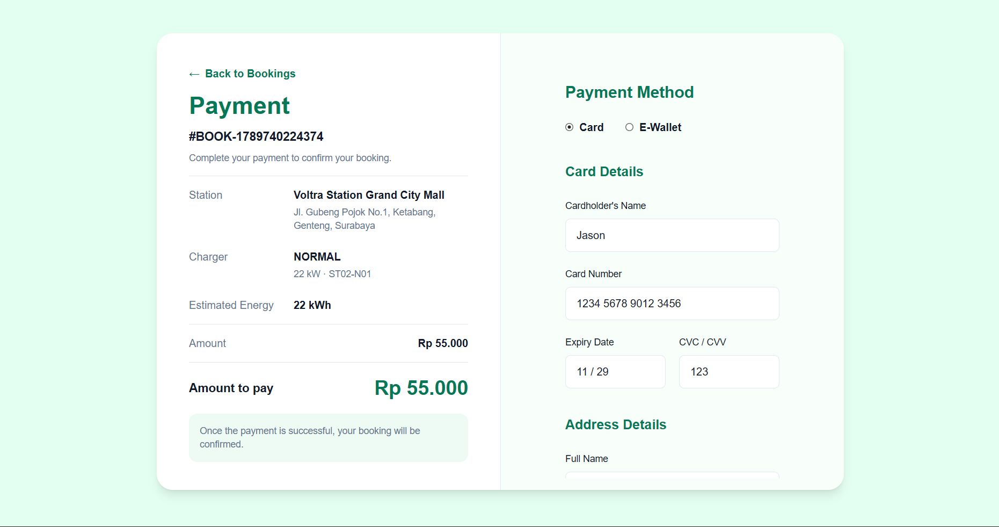

### Bookingpage
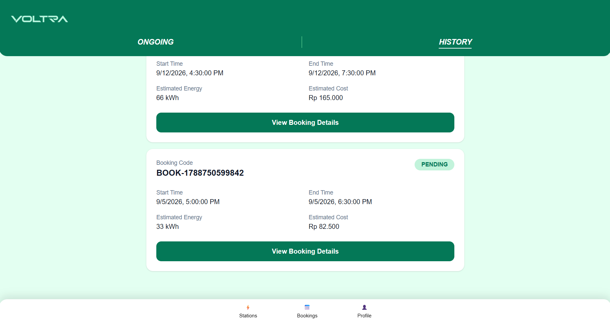
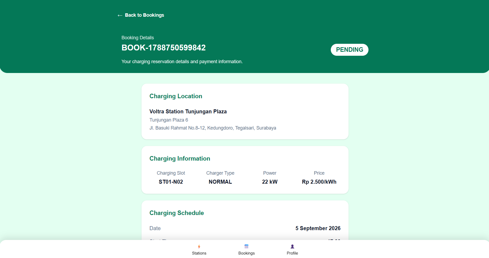

### ProfilePage
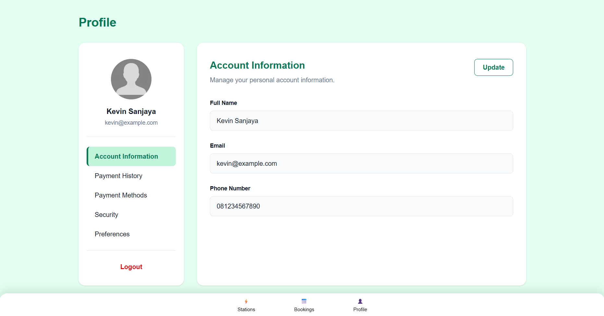